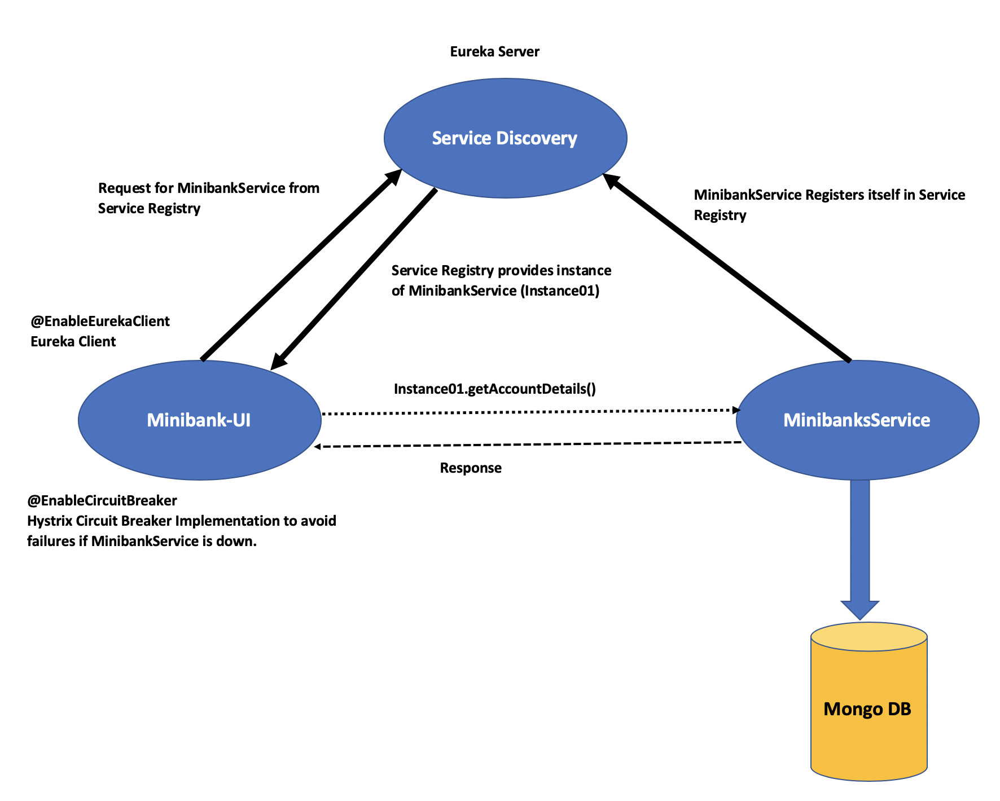
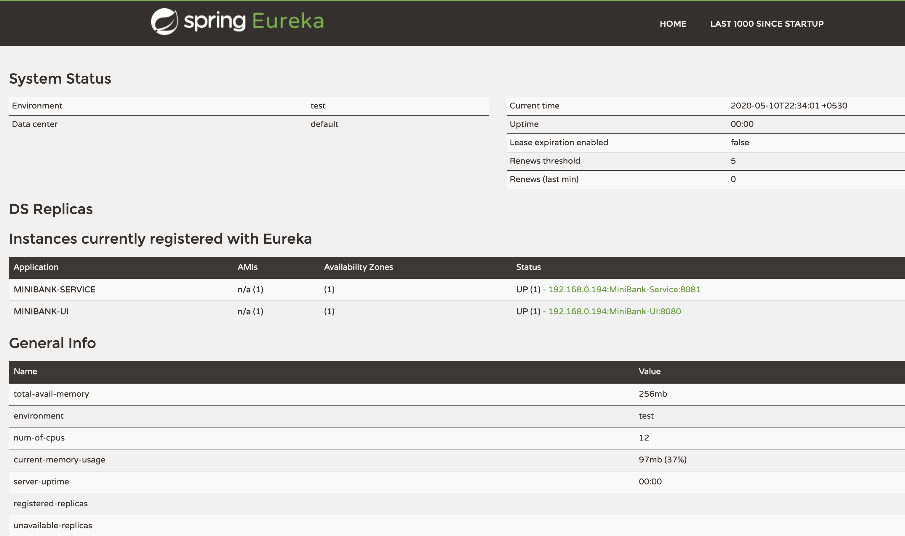
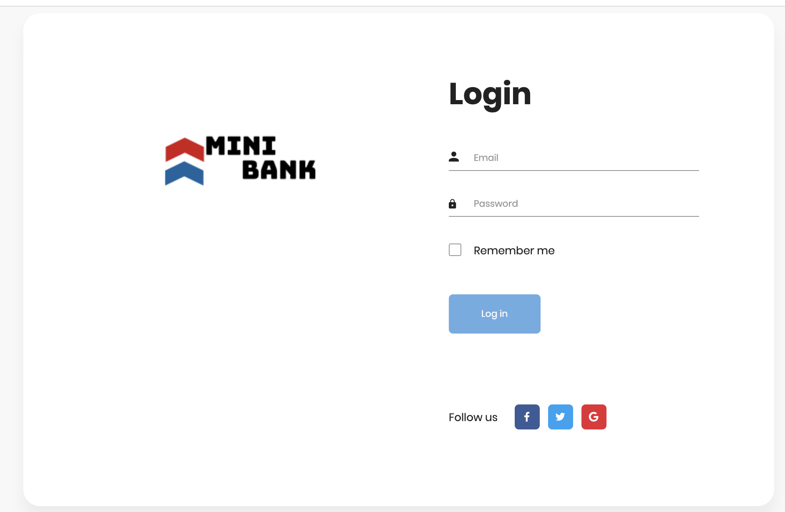
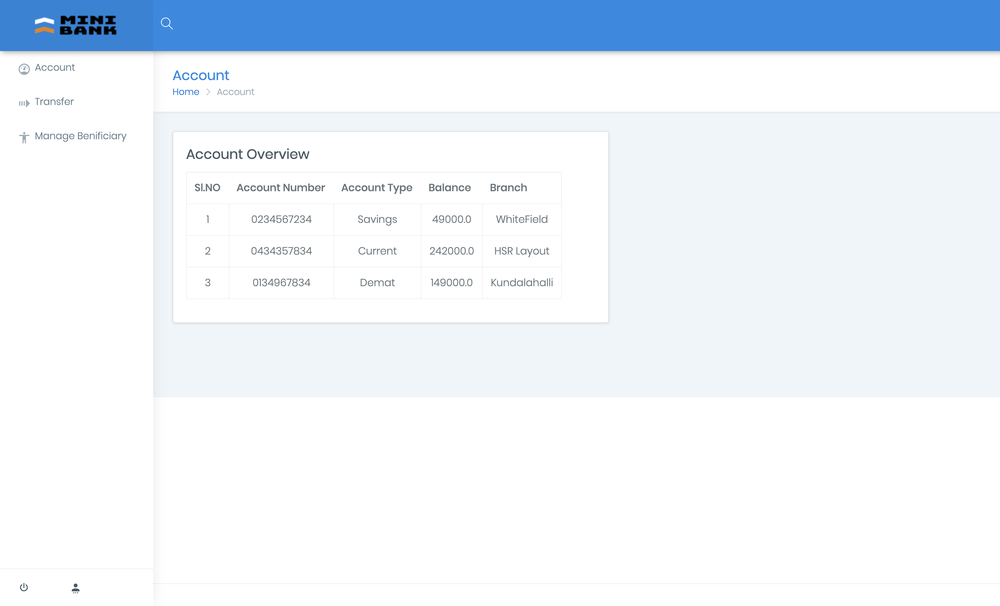
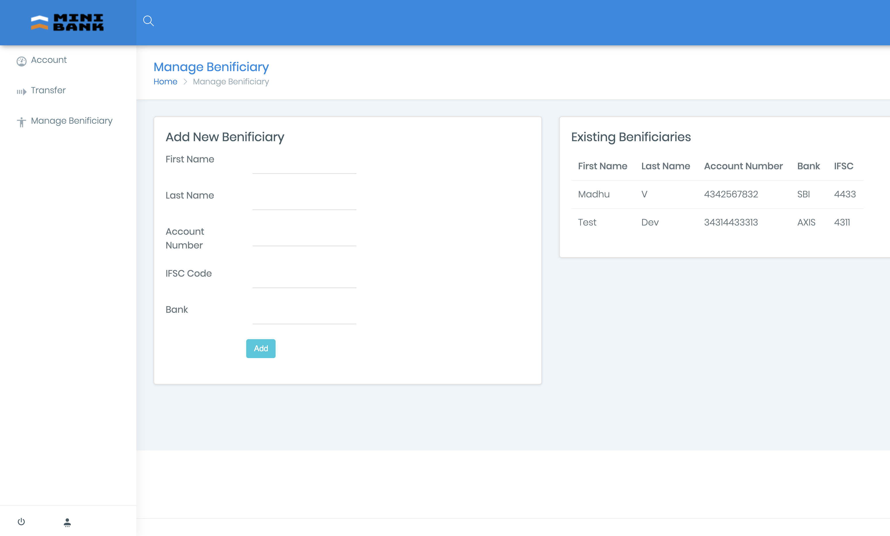
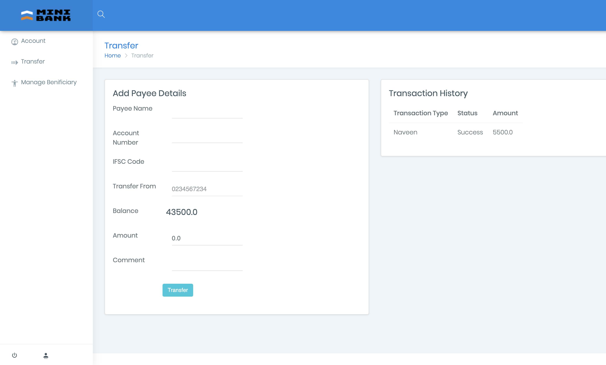

# minibank-springboot-microservices(Development Still in Progress)

## Table of Contents ##
1. [Application Scope](#Application-Scope)
2. [Upcoming Enhancement](#Upcoming-enhancement)
3. [Technology](#Technology)
4. [Architecture](#Architecture)
5. [Pre-Requisite](#Pre-Requisite)
6. [Running Microservices Locally](#Running-Microservices-Locally)
7. [Running in Docker Container](#Running-in-Docker-Container)

## Application Scope ##

1. How to build microservices using spring-boot. 
2. How to register microservices in Service registry using Netflix Eureka.
3. How to build docker image for each microservice. 
4. Simple use case to demonstrate circuit breaker using Netflix Hystrix.

## Upcoming enhancement ##
1. Asynchronous communication using Message Broker(**RabbitMQ or Kafka**)
2. Integrate **Spring Security** for Authentication and Authorization.

## Technology ##
1. Spring Boot
2. Spring Cloud
3. Spring Data
4. Netflix Eureka(Service Discovery)
5. Hystrix (Latency and Fault tolerance)
6. Spring Dev Tools
7. Thymeleaf as Template

## Architecture ##

## Pre Requisite ##
1. Jdk 1.8 or 1.11
2. Maven
3. Mongo DB

## Running Microservices Locally ##

1. Build each Microservice using mvn clean install .
2. Start "servicediscovery" microservice using mvn spring-boot:run
3. Start "minibank-ui" microservice using mvn spring-boot:run
4. Start "minibank-service" microservice using mvn spring-boot:run

Open http://localhost:9090 to see the service registry(Eureka Server UI)

## Running in Docker Container ##

**Using JDK 1.8 for now in docker file and pom.xml as target release**

All the Below Commands can be Automated and simplied by using docker-compose.
For Demonstration, Using basic docker commands to know how it works internally.

	1. Docker Commands to build image
	 
	• Open Terminal in servicediscovery :  docker build --tag servicediscovery  .
	• Open Terminal in minibank-ui :  docker build --tag minibank-ui .
	• Open Terminal in minibank-service :  docker build --tag minibank-service .

	2. Docker Commands to run container

	Run Db container:  
	
	• docker pull mongo
	• docker  run -it --name mongo-minibank -d mongo
		
	Create and Start Containers:

	• Service Discovery : docker run -p 9090:9090 -it --name servicediscovery -d servicediscovery
	
	Running the container + Linking it to dependent containers
	
	• MiniBank-UI      : docker run -p 8080:8080 -it --name minibank-ui --link servicediscovery -d minibank-ui
	• MiniBank-Service : docker run -p 8081:8081 -it --name minibankservice --link servicediscovery --link mongo-minibank -d minibank-service

Open http://localhost:8080

# Login Page

# Account Dashboard

# Manage Benificiary

# Transfer

# Feedback
Email : sach.bennur@gmail.com
